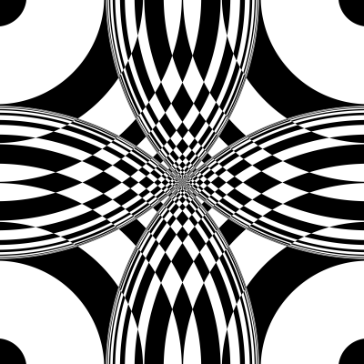

# Computer Vision Techniques

This project implements various filters, effects, and image processing
methods in Python using the NumPy module. The project code has been
written to reflect the logic behind the methods, not to maximise their
internal efficiency.

Python is an interpreted language that takes enormous amounts of time to
execute large nested loops. Therefore, NumPy has been used to speed up
calculations. It does this by running the same operation in all the
cells of an array in parallel.

## Selected images

The images included in this report have been obtained from the author's
camera roll. Many have been taken with different devices through the
years, which explains the differences in quality between some images.

The images have been selected because they contain interesting elements
for the experiments ---colours, shapes, noise, or others. The images
that provided the most interesting results for the given method were
used in each section.

The synthetic images used to test rescaling methods were obtained from
the [TEST IMAGES
dataset](https://www.tandfonline.com/doi/full/10.1080/2165347X.2015.1024298).

## Photo effects

### Saturation enhancement

Saturation enhancement is an image processing technique for both
technical and artistic purposes. For practical purposes, it can be used
to correct colour blandness due to physical or optical causes. It can
also help people with moderate colour blindness or visual impairments to
visualise colours more easily. For artistic purposes, it is often used
to give a sense of exuberance or to make photographs more attractive.

One of the most intuitive ways to implement this filter is to convert
the colour model from RGB to HSV or HSL. Therefore, conversions between
RGB, BGR, Grayscale, HSV, and HSL colour modes have been implemented for
this project. Actually, only the RGB $\leftrightarrow$ BGR, RGB
$\leftrightarrow$ Grayscale, RGB $\leftrightarrow$ HSV, and HSV
$\leftrightarrow$ HSL conversions have been implemented, as the others
can be expressed as combinations of these. The conversions between RGB
and BGR were implemented because OpenCV ---the software used to read and
save the images--- uses this model by default. The mathematics for the
conversions between RGB, HSV, and HSL have been obtained from the
conversion formulas in
[Wikipedia](https://en.wikipedia.org/wiki/HSL_and_HSV). The code on
[ICALM.org](https://www.icaml.org/canon/data/images-videos/HSV_color_space/HSV_color_space.html)
has also been used as a template, but it has been modified to
parallelise it with NumPy.

``` python
def split_channels(img):

    '''
    Split the channels of an image into separate images.
    
    Args:
        img (np.array): The image.

    Return:
        The channels in a tuple.
    '''

    number_of_channels = img.shape[2]

    return tuple([img[:, :, c] for c in range(number_of_channels)])

def merge_channels(channels):

    '''
    Merge the channels of an image into one single image.
    
    Args:
        channels (tuple): A tuple containing the channels to be merged.
        
    Result:
        The resulting image combined.
    '''

    return np.dstack((channels))

def saturation_apply_scale(img, scale):

    '''
    Scale the saturation channel of an HSL image img by the scale float.
    
    Args:
        img (np.array): An HSL image.
        scale (float):  An scaling float.
        
    Return:
        The image after modifying its saturation channel.
    '''

    # Convert the image to HSV.
    img_hsv = color_rgb_to_hsv(img)

    # Split the channels.
    h, s, v = split_channels(img_hsv)

    # Multiply the Saturation channel by the scale we decided.
    # We need to clip values that are out of range.
    s =  np.minimum(s * scale, np.ones_like(s))

    # Join the channels again.
    img_hsv = merge_channels((h, s, v))

    # Convert it back to RGB and return it.
    return color_hsv_to_rgb(img_hsv)
```

The code included above these lines shows the implementation of the
saturation enhancement filter. It has been written following the
functional style: to perform actions, it calls other functions. For
example, the split_channels and merge_channels functions are almost
NumPy aliases to operate with arrays more intuitively. These functions
split or merge the colour channels of an image. Thus, an RGB image can
be an MxNx3 matrix or three MxN matrices.

Thus, this code converts the image from RGB to HSV and separates the
channels into three matrices H, S, and V. The S matrix is then used to
operate. Next, each element in the S matrix is scaled using the scale
parameter, whose result is clipped to 1 to avoid unwanted overflows in
the final image. Finally, the resulting HSV image is converted to RGB
again and returned.

<figure id="fig:saturation_florence">
<p> </p>
<p> </p>
<figcaption>Saturation enhancement: (a) original image; (b) scale = 1.0;
(c) scale = 1.5; (d) scale = 2.0.</figcaption>
</figure>

<figure id="fig:saturation_medulas">
<p> </p>
<p> </p>
<figcaption>Saturation enhancement: (a) original image; (b) scale = 1.0;
(c) scale = 1.5; (d) scale = 2.0.</figcaption>
</figure>

<figure id="fig:saturation_skyline">
<p> </p>
<p> </p>
<figcaption>Saturation enhancement: (a) original image; (b) scale = 1.0;
(c) scale = 1.5; (d) scale = 2.0.</figcaption>
</figure>

Figures [1](#fig:saturation_florence){reference-type="ref"
reference="fig:saturation_florence"},
[2](#fig:saturation_medulas){reference-type="ref"
reference="fig:saturation_medulas"} and
[3](#fig:saturation_skyline){reference-type="ref"
reference="fig:saturation_skyline"} show the results of this filter on
three different images using different scale parameters. A very
noticeable difference in the blue tones of the images can be observed
between the original image and the one filtered with scale=1.0.
Intuitively, this should not occur. After reviewing the implementation
and various articles, the conclusions are that this is due to a mismatch
between the two colour models, as expressed by the formulas shown in
Wikipedia ([Wikipedia](https://en.wikipedia.org/wiki/HSL_and_HSV)). The
other shades, however, do show a direct correspondence.

It is interesting to note how the colours become much more vibrant as
the scale parameter increases in the bottom two images of each Figure.
As a counterpart, it can also be seen how the image noise becomes more
visible in Figure [3](#fig:saturation_skyline){reference-type="ref"
reference="fig:saturation_skyline"} as this parameter increases.

### Duotone

Duotone is a remarkably artistic filter. In the pre-digital era, there
were already techniques to create this filter by post-processing.
Nowadays, it is usually done using image editing programs such as Adobe
Photoshop
([here](https://creativecloud.adobe.com/en-IE/learn/photoshop/web/add-duotone-color-effect)).
It is widely used in commercial graphic design and editing for its
visually attractive results.

This effect is based on converting a grayscale image to an image in a
scale of two different colours. In other words, it is an image in which
every pixel's brightness is used to interpolate two colours. In a
conventional grayscale image, colours could be explained as a gradient
between black and white. Duotone allows using any colour of the RGB
spectrum for this purpose.

``` python
def duotone(img, color1, color2):

    '''
    Apply a duotone effect to the image.
    
    Args:
        img (np.array): A grayscale image.
        color1 (np.array):  'Shadows' RGB color.
        color2 (np.array):  'Lights' RGB color.
        
    Return:
        The image after applying the duotone.

    See:
        https://helpx.adobe.com/ie/photoshop/how-to/add-duotone-color-effect.html
    '''

    # Convert the image to gray.
    img = color_rgb_to_gray(img)

    # Normalize the image.
    img_norm = img / 255

    # Push the extrems to 0 and 1.
    img_norm = img_norm - np.min(img_norm)
    img_norm = img_norm / np.max(img_norm)

    # The basic formula for interpolation is n1 + (n2 - n1) * step.
    # We will do this with NumPy.

    # Create two images of pure color1 and pure color2.
    img_color1 = np.ones((img.shape[0], img.shape[1], color1.shape[0]), int)
    img_color1 *= np.array(color1, dtype='uint8')

    img_color2 = np.ones((img.shape[0], img.shape[1], color2.shape[0]), int)
    img_color2 *= np.array(color2, dtype='uint8')

    # Apply the interpolation function.
    step = merge_channels((img_norm, img_norm, img_norm))
    return np.array(color1 + (color2 - color1) * step, dtype='uint8')
```

The code above these lines shows the implementation of the duotone
filter. First, the image is converted to grayscale to get the brightness
of each pixel in a matrix. This array is then normalised so that the
values are decimals from 0 to 1. For more striking results, the minimum
value is pushed to 0 and the maximum to 1. Finally, two arrays
containing the pure colours are created, and the brightness matrix is
used as the step in the colour interpolation.

<figure id="fig:duotone_chicago">
<p> </p>
<figcaption>Duotone effect: (a) original image; (b) red and purple
duotone.</figcaption>
</figure>

<figure id="fig:duotone_leon">
<p> </p>
<figcaption>Duotone effect: (a) original image; (b) yellow and purple
duotone.</figcaption>
</figure>

<figure id="fig:duotone_nyc">
<p> </p>
<figcaption>Duotone effect: (a) original image; (b) blue and red
duotone.</figcaption>
</figure>

Figures [4](#fig:duotone_chicago){reference-type="ref"
reference="fig:duotone_chicago"},
[5](#fig:duotone_leon){reference-type="ref"
reference="fig:duotone_leon"} and
[6](#fig:duotone_nyc){reference-type="ref" reference="fig:duotone_nyc"}
show the results of this filter on three different images using
different interpolating colours. These filters obtain a striking version
of the image when used with cautiously selected colours, as they get
unexpected contrasts from the original image.

### Stained glass

The stained glass filter is an essentially artistic effect. It obtains a
visually intriguing result where pixels are grouped together with other
nearby pixels to form homogeneous colour groups using the average of
their original colours. The result is an image similar to a stained
glass pattern or the result of viewing the image through translucent and
irregular glass.

This effect is obtained by creating a series of generator points and
grouping the pixels of the image according to their closest generator
point.

``` python
def stained_glass(img, pnts):

    '''
    Apply a stained glass effect.
    
    Args:
        img (np.array): An RGB image.
        pnts (int): The number of generating points in the stained glass effect.

    Return:
        An image after applying the stained glass effect.
    '''

    # Get the dimensions. We do not mind the depth. It will be handled by func.
    height = img.shape[0]
    width = img.shape[1]

    # Get the position of the generating points.
    gen_points = np.array([(randint(0, height), randint(0, width)) for x in range(pnts)])

    # Get all X and Y pixel indices in an array.
    # This means that pixel_indices[Y, X] = [Y, X].
    pixel_indices = np.indices((height, width))
    pixel_indices = merge_channels((pixel_indices[0], pixel_indices[1]))

    # Init the datastructure to store the closest point yet and the minimum distance.
    closest_labels = np.zeros((height, width))
    minimum_distances = np.matrix(np.ones((height, width)) * np.inf)

    # Iterate by all the generating points.
    for i, gen in enumerate(gen_points):

        # Now get the euclidian distance from each pixel in the image to the gen point.
        # We can do this using NumPy.
        gen_distances = np.sum((pixel_indices - gen) ** 2, axis=2)

        # Everywhere where this distance is shorter than the current minimum distance, get indices.
        change_labels = gen_distances < minimum_distances

        # Use those indexes to store the new minimum distances and minimum labels.
        closest_labels[change_labels] = i
        minimum_distances[change_labels] = gen_distances[change_labels]

    # Init the return variable.
    ret_img = np.zeros_like(img)

    # Iterate by all the generating points.
    # Now all the points in closest_labels have been correctly set.
    for i, gen in enumerate(gen_points):

        # Get all the colors summed and all the label counts to compute the average color of the
        # area.
        area_ind = closest_labels == i
        avg_colors = np.mean(img[area_ind], axis=(0))

        # Get the average color and put in on all those positions of ret_img corresponding to those
        # pixels.
        ret_img[area_ind] = avg_colors

    return ret_img
```

The code above these lines shows the implementation of the window
filter. First, a series of generator points are generated in the range
of the image. Then, using a loop, the geometric distance of each pixel
to each generator point is obtained, and it is determined which point
has the minimum distance to each pixel. Within this loop, each pixel is
labelled with the index of the generating point assigned to it. Finally,
for each generating point, the average colour of all its pixels is
computed, and the newly calculated average replaces the original colour.

<figure id="fig:stained_glass_florence">
<p> </p>
<figcaption>Stained glass effect: (a) original image; (b) stained glass
effect.</figcaption>
</figure>

<figure id="fig:stained_glass_medulas">
<p> </p>
<figcaption>Stained glass effect: (a) original image; (b) stained glass
effect.</figcaption>
</figure>

<figure id="fig:stained_glass_leon">
<p> </p>
<figcaption>Stained glass effect: (a) original image; (b) stained glass
effect.</figcaption>
</figure>

Figures [7](#fig:stained_glass_florence){reference-type="ref"
reference="fig:stained_glass_florence"},
[8](#fig:stained_glass_medulas){reference-type="ref"
reference="fig:stained_glass_medulas"} and
[9](#fig:stained_glass_leon){reference-type="ref"
reference="fig:stained_glass_leon"} show the results of this filter on
three different images. These filters obtain an odd-looking version of
the image that looks intriguing and not trivial. The shapes of the main
objects can still be appreciated, although heavily distorted. The more
minor details of the images are mostly lost due to the nature of the
filter. An exciting aspect of this filter is its random nature, as every
iteration will obtain a slightly different result.

### Emboss

The embossing effect results from convolving an image with one of the
well-known embossing kernels. This effect highlights pixel-by-pixel
colour differences to create an embossed or highlighted feel. This
filter has artistic applications---it creates an interesting image when
applied---and it also has practical uses. It can be used to enhance the
contrasts in an image, to create bump maps from images, and for many
other uses.

There are different emboss kernels by diameter and direction ---they can
be vertical, horizontal, or mixed. In this project, mixed emboss kernels
have been implemented where a vertical, a horizontal, and a vertical
kernel are combined.

This filter is the first example of a convolution introduced in this
project. Therefore, the methods to convolve an image are explained below
this lines, although they are used all across the project.

``` python
def convolve(img, kernel, pad=True):

    '''
    Performs a kernel convolution on image img using the kernel.
    
    Args:
        img (np.array):  An image as a numpy array. It is one-dimensional or 3 dimensional.
        kernel (np.array): The kernel that will be used to compute the convolution.
        pad (Boolean): Whether to add padding before convolving or not.

    Return:
        The convolved image.
    '''

    # Get the kernel size.
    kernel_height = kernel.shape[0]
    kernel_width = kernel.shape[1]

    # Get the padding sizes.
    pad_y = kernel_height // 2
    pad_x = kernel_width // 2

    # Apply the padding to the image if it was set to true.
    if pad is True:
        img = np.pad(img, ((pad_y, pad_y), (pad_x, pad_x)), mode='edge')

    # Get the image size.
    img_height = img.shape[0]
    img_width = img.shape[1]

    # Get the convolved image sizes.
    conv_height = img_height - (kernel_height - 1)
    conv_width = img_width - (kernel_width - 1)

    convolved_image = np.zeros((conv_height, conv_width))

    for y in range(kernel_height):
        for x in range(kernel_width):

            # Get the end index.
            # This is the index next to the last one we want to get.
            end_y = img_height - (kernel_height - y) + 1
            end_x = img_width - (kernel_width - x) + 1

            # Get the current submatrix.
            submatrix = img[y:end_y, x:end_x]

            # Add the current submatrix, multiplied by the kernel element.
            convolved_image = convolved_image + (submatrix * kernel[y, x])

    return convolved_image

def convolve_all_channels(img, kernel, pad=True):

    '''
    Performs a kernel convolution on the N channels of image img using the kernel.
    
    Args:
        img (np.array):  An image as a numpy array. It is one-dimensional or 3 dimensional.
        kernel (np.array): The kernel that will be used to compute the convolution.
        pad (Boolean): Whether to add padding before convolving or not.

    Return:
        The convolved image.
    '''

    # Split the channels.
    channels = split_channels(img)

    # Apply the convolution to all channels.
    channels = [convolve(c, kernel, pad) for c in channels]

    # Join the channels again.
    return merge_channels(channels)
```

Above these lines are the convolve and convolve_all_channels functions.
The convolve function is essential in this project, as it is used
throughout all the remaining sections. This implementation seeks to
speed up the execution of convolutions using NumPy while allowing the
main logic of the convolution algorithm to be seen. The original
convolution algorithm consists of 4 nested loops traversing the rows and
columns of the original image and the rows and columns of the kernel.
The main difference between the implementation shown here and the
original algorithm is that the operations for all the image cells are
executed in parallel. Instead of fetching one cell at a time and
operating on a single kernel element, we fetch all cells simultaneously
and operate on the kernel element. This computed cell array is added to
the convolved_image accumulator.

The convolve_all_channels function is just a helper function that
separates the three channels using the split_channels and merge_channels
functions to perform a convolution on each channel using the kernel.

``` python
def emboss(img, kernel_size):

    '''
    Implements an emboss filter in n-dimensions.

    Args:
        img (np.array): An RGB image.
        kernel_size (number): Size of the kernel to be generated.

    Returns:
        The resulting image after applying the convolution.
    '''

    # Make sure the kernel size is an odd number. Otherwise, make it odd by adding one and print a
    # warning.
    if kernel_size % 2 == 0:
        kernel_size += 1

    # Generate the kernel.
    kernel = np.zeros((kernel_size, kernel_size))
    k_x, k_y = np.indices((kernel_size, kernel_size)) - (kernel_size // 2)

    # The diagonal line is made of 2s.
    kernel[k_x == k_y] = 2

    # The horizontal & vertical lines are composed of 1.
    kernel[k_x == 0] = 1
    kernel[k_y == 0] = 1

    # Values on the top left part are negative.
    kernel[np.logical_or(k_y < 0, k_x < 0)] *= -1

    # Detect if it is 1-dimensional or n-dimensional.
    if len(img.shape) == 2:

        # Convolve the image as a simple 1-channel image.
        ret_image = convolve(img, kernel)

    else:

        # For each channel, convolve it.
        channels = split_channels(img)

        # Convolve the image channels as a simple 1-channel image.
        channels_conv = [convolve(chan, kernel) for chan in channels]

        # Join the channels.
        ret_image = merge_channels(channels_conv)

    # Clip the image.
    ret_image = np.round(ret_image)
    ret_image[ret_image > 255] = 255
    ret_image[ret_image < 0] = 0

    return ret_image.astype('uint8')
```

The code shown above these lines contains the main logic of the
embossing filter. The first task creates the kernel since the only
additional parameter passed to this function is the size of the kernel.
For this, a matrix of zeros is created, and 2s are inserted in the
diagonal of the matrix. 1s are inserted, as well, into the centre
vertical and centre horizontal of the matrix. The image is then
convolved using this kernel---whether it is a 3-channel or 1-channel
image. Finally, the values that leave the range 0 to 255 are clipped to
avoid strange behaviour, and the image is returned.

<figure id="fig:emboss_hotel_vela">
<p> </p>
<figcaption>Embossing: (a) original image; (b) embossed image
(kernel_size = 5)</figcaption>
</figure>

<figure id="fig:emboss_bce">
<p> </p>
<figcaption>Embossing: (a) original image; (b) embossed image
(kernel_size = 5)</figcaption>
</figure>

<figure id="fig:emboss_catacumbas">
<p> </p>
<figcaption>Embossing: (a) original image; (b) embossed image
(kernel_size = 5)</figcaption>
</figure>

Figures [10](#fig:emboss_hotel_vela){reference-type="ref"
reference="fig:emboss_hotel_vela"},
[11](#fig:emboss_bce){reference-type="ref" reference="fig:emboss_bce"}
and [12](#fig:emboss_catacumbas){reference-type="ref"
reference="fig:emboss_catacumbas"} show the results of this filter.
Figure [10](#fig:emboss_hotel_vela){reference-type="ref"
reference="fig:emboss_hotel_vela"} creates a rather visually exciting
result, as it is the one where the results obtain a most different
effect. Figures [11](#fig:emboss_bce){reference-type="ref"
reference="fig:emboss_bce"} and
[12](#fig:emboss_catacumbas){reference-type="ref"
reference="fig:emboss_catacumbas"} show results that could be regarded
as similar to some extreme sharpening, although the results are pretty
different when paying close attention.

### Yoakumization

This effect is not---to my knowledge---a well-known effect described in
the literature, but the result of creatively combining several effects
that were programmed during the development of this project to obtain a
very different image than the original. Although the initial experiments
that led to this filter were intended to achieve a sketch result, the
obtained filter does not achieve quite that. This filter has been named
after American artist Joseph Yoakum (1891-1972) for how the effects of
this filter---in my own opinion---resemble his unusual painting style.

This filter combines bilateral filtering, quantisation, outlining
convolution, thresholding, and antialiasing convolution. However,
bilateral filtering is only a component of this filter that was added in
replacement of others in the latest stages of the project. It is also
used in the following sections, with a much more critical role.
Therefore, its implementation is not discussed in here but in Section
6.3.

``` python
def yoakumization(img, levels, bilateral_size, sigma1, sigma2):

    '''
    Apply a cartoon effect to the image.

    Args:
        img (np.array): An RGB image.
        levels (int): Number of quantization levels.
        bilateral_size (number): Bilateral filter size that will be applied.
        sigma1 (number): Bilateral filter sigma 1 that will be applied.
        sigma2 (number): Bilateral filter sigma 2 that will be applied.

    Return:
        An image after applying the stained glass effect.
    '''

    # Make sure the kernel size is an odd number. Otherwise, make it odd by adding one and print a
    # warning.
    if bilateral_size % 2 == 0:
        bilateral_size += 1
        print_debug('Kernel size must be odd. The value used will be {}'.format(bilateral_size))

    # Apply a bilateral filter to remove textures.
    channels = split_channels(img)
    channels = [bilateral_filter(c, bilateral_size, sigma1, sigma2) for c in channels]
    smooth_image = merge_channels(channels)

    # Get the quantization size.
    step = 255 // levels

    # Apply a quantization filter to the image.
    img_quant = (smooth_image // step) * step

    # Get the outlining kernel.
    kernel = np.array([
        [ 1,  1,  1],
        [ 1, -8,  1],
        [ 1,  1,  1]
    ])
    outlined = convolve_all_channels(img_quant, kernel, True)
    outlined[outlined > 255] = 255
    outlined[outlined < 0] = 0

    # Convert it to black and white cause we only care abut lines themselves.
    outlined = color_rgb_to_gray(outlined).astype('float32')

    # Threshold it.
    outlined[outlined < 10] = 0
    outlined[outlined >= 10] = 0.5

    # Invert it to use it as a mask.
    outlined = 1 - outlined

    # Multiply the outline by the quantization.
    ret_img =  img_quant.astype('float32') * merge_channels((outlined, outlined, outlined))

    # Round it to have proper values.
    ret_img = np.round(ret_img)
    
    # Convolve it to get a filter to avoid heavy aliasing.
    # Get the outlining kernel.
    kernel = np.array([
        [ 0,  1,  0],
        [ 1,  4,  1],
        [ 0,  1,  0]
    ])
    ret_img = convolve_all_channels(ret_img, kernel, True)
    ret_img = ret_img // np.sum(kernel)

    return ret_img.astype('uint8')
```

The code above these lines shows the implementation of this unusual
filter. First, a bilateral filter is applied to the different channels
of the image to obtain an image without texture and with a flat
appearance. The resulting colours are then quantisised to obtain
homogeneous colour regions that contrast. Next, an outlining convolution
is applied to obtain the edges of the colour regions. Next, this image
containing the edges is converted to grayscale to obtain a single value
for each pixel. Following, it is thresholded so that all the values are
either 0 or 0.5. After inverting the values, the quantisised image is
multiplied by this new mask. This causes those pixels considered edges
to drastically lower their colour without becoming black. Finally, a
smooth antialiasing convolution is applied to reduce edge aliasing and
give the image a smoother look.

<figure id="fig:yoakum_medulas_crop">
<p> </p>
<figcaption>Yoakumisation: (a) original image; (b) Yoakumised
image</figcaption>
</figure>

<figure id="fig:yoakum_trinity_day_crop">
<p> </p>
<figcaption>Yoakumisation: (a) original image; (b) Yoakumised
image</figcaption>
</figure>

<figure id="fig:yoakum_leon_catedral_exterior">
<p> </p>
<figcaption>Yoakumisation: (a) original image; (b) Yoakumised
image</figcaption>
</figure>

Figures [13](#fig:yoakum_medulas_crop){reference-type="ref"
reference="fig:yoakum_medulas_crop"},
[14](#fig:yoakum_trinity_day_crop){reference-type="ref"
reference="fig:yoakum_trinity_day_crop"}, and
[15](#fig:yoakum_leon_catedral_exterior){reference-type="ref"
reference="fig:yoakum_leon_catedral_exterior"} show the result of
applying this filter to the images. The outcome resembles a drawing,
although it shows unusual colours and stripes, as well as strongly
marked edges in dark colours.

## Sharpening, blur, and noise removal

### Median filter

``` python
def median_filter(img, kh, kw):

    '''
    Apply a Median blur effect to the image img.
    
    Args:
        img (np.array): An RGB image.
        kh (int): The to-be-generated kernel height.
        kw (int): The to-be-generated kernel width.

    Return:
        An image after applying the gaussian blur.
    '''

    # Generate the kernel from the specified arguments.
    kernel = np.ones((kh, kw))

    # Convert the image to uint64 to avoid overflows.
    img = img.astype('uint64')

    # Convolve the image using the kernel.
    result_img = convolve_all_channels(img, kernel, True)

    # Normalize the image.
    result_img = result_img // np.sum(kernel)

    return result_img.astype('uint8')
```

The code above shows the implementation of the median filter in this
project. Having described all the functions this method uses, the code
is straightforward. First, the kernel is created as a KHxKW matrix of
ones. Then this kernel is convolved on the image, and finally, the image
is scaled by 1/9---the sum of the kernel cells--- to regain the initial
colour range.

This relatively simple filter can get excellent results when used with
small kernels to reduce image noise. Figures A, B and C show the results
of applying the median filter to 3 selected noisy pictures. The kernel
sizes have been selected considering the shapes and noise found in the
images.

<figure id="fig:median_trinity_noche">
<p> </p>
<figcaption>Median filter: (a) original image; (b) median filter (kh =
3, kw = 3)</figcaption>
</figure>

<figure id="fig:median_empire_state_bad">
<p> </p>
<figcaption>Median filter: (a) original image; (b) median filter (kh =
9, kw = 3)</figcaption>
</figure>

<figure id="fig:median_hotel_vela">
<p> </p>
<figcaption>Median filter: (a) original image; (b) median filter (kh =
7, kw = 7)</figcaption>
</figure>

Figure [16](#fig:median_trinity_noche){reference-type="ref"
reference="fig:median_trinity_noche"} shows little improvement due to
the kind of noise found in the image. The noise does not limit to pixels
with high colour variation but is composed of more extensive areas of
patches with artefacts caused by the camera's night mode. Therefore,
when applying a kernel large enough to manage this kind of noise, the
image becomes too blurry.

Figure [17](#fig:median_empire_state_bad){reference-type="ref"
reference="fig:median_empire_state_bad"} shows the best results of the
three images. The original image contains two problems: it is noticeably
blurry, and it contains very sharp noise. This combination is due to the
fact that it is a scanned copy of a blurred photo. A significant noise
reduction is achieved by applying a mostly vertical kernel to this
image---desirable because of the shape of the main objects. Although it
also introduces blur, this fact is concealed by the blur the photo
initially contained.

Figure [18](#fig:median_hotel_vela){reference-type="ref"
reference="fig:median_hotel_vela"} shows a significant reduction in
noise in clear areas, despite losing sharpness in sharp contrast areas.
However, removing the most noticeable noise artefacts is only possible
by making the image very blurry.

### Gaussian blur

``` python
def gaussian_func(x, y, sigma):

    '''
    Calculate the gaussian function for given X, Y and sigma values.
    
    Args:
        x (number): X variable of the gaussian function.
        y (number): Y variable of the gaussian function.
        sigma (number): Sigma constant.

    Return:
        The result of the gaussian function.
    '''

    # Split the formula in two to make it readable.
    gauss1 = 1 / (2 * np.pi * sigma ** 2)
    gauss2 = np.exp(-(x ** 2 + y ** 2) / (2 * sigma ** 2))

    return gauss1 * gauss2

def gaussian_blur(img, kh, kw, sigma):

    '''
    Apply a Gaussian blur effect to the image img.
    
    Args:
        img (np.array): An RGB image.
        kh (int): The to-be-generated kernel height.
        kw (int): The to-be-generated kernel width.
        sigma (number): Sigma constant.

    Return:
        An image after applying the gaussian blur.
    '''

    # Generate the gaussian kernel from the specified arguments.
    gauss_y, gauss_x = np.indices((kh, kw), dtype='float64')
    gauss_y -= kh // 2
    gauss_x -= kw // 2
    kernel = gaussian_func(gauss_x, gauss_y, sigma)

    # Normalize the kernel to integers.
    # kernel = (kernel // np.min(kernel)).astype('uint64')

    # Convert the image to uint64 to avoid overflows.
    img = img.astype('float64')

    # Convolve the image using the kernel.
    result_img = convolve_all_channels(img, kernel, True)

    # Normalize the image.
    result_img = result_img // np.sum(kernel)

    return result_img.astype('uint8')
```

The code above shows the implementation of the Gaussian blur filter in
this project. Function gaussian_func implements the Gaussian function,
defined on its 1 and 2 dimensions as:

$${G(x)={\frac {1}{2\pi \sigma ^{2}}}e^{-{\frac {x^{2}}{2\sigma ^{2}}}}}; {G(x, y)={\frac {1}{\sqrt {2\pi \sigma ^{2}}}}e^{-{\frac {x^{2}+y^2}{2\sigma ^{2}}}}}$$

The function implemented in this project is done using NumPy and allows
to make the calculations in parallel for big sets of X and Y values.

Function Gaussian_blur implements the filter itself. The kernel height,
width, and sigma values are the only parameters in this function.
Therefore, the first task in the function is to build the Gaussian
kernel. First, NumPy's indices method obtains the X and Y indices of the
matrix's cells as matrices. Next, these matrices are normalised around
its centre---making the index on the centre (0,0). Then vertical and
horizontal indexes are fed to the gaussian_func matrix to obtain the
value for each cell. Finally, this kernel is used to convolve the image,
and the image is normalised before returning it.

<figure id="fig:gaussian_blur_trinity_noche">
<p> </p>
<p> </p>
<figcaption>Gaussian blur: (a) original image; (b) kh = 5, kw = 5, <span
class="math inline"><em>σ</em></span> = 1; (c) kh = 5, kw = 5, <span
class="math inline"><em>σ</em></span> = 5; (d) kh = 10, kw = 10, <span
class="math inline"><em>σ</em></span> = 0.5.</figcaption>
</figure>

<figure id="fig:gaussian_blur_empire_state_bad">
<p> </p>
<p> </p>
<figcaption>Gaussian blur: (a) original image; (b) kh = 5, kw = 5, <span
class="math inline"><em>σ</em></span> = 1; (c) kh = 5, kw = 5, <span
class="math inline"><em>σ</em></span> = 5; (d) kh = 10, kw = 10, <span
class="math inline"><em>σ</em></span> = 0.5.</figcaption>
</figure>

<figure id="fig:gaussian_blur_hotel_vela">
<p> </p>
<p> </p>
<figcaption>Gaussian blur: (a) original image; (b) kh = 5, kw = 5, <span
class="math inline"><em>σ</em></span> = 1; (c) kh = 5, kw = 5, <span
class="math inline"><em>σ</em></span> = 5; (d) kh = 10, kw = 10, <span
class="math inline"><em>σ</em></span> = 0.5.</figcaption>
</figure>

Gaussian blur is much more delicate when dealing with image noise than
other filters. It achieves results with a more continuous appearance
than the median filter without having to give up the sharpness of the
objects in return.

Figures [19](#fig:gaussian_blur_trinity_noche){reference-type="ref"
reference="fig:gaussian_blur_trinity_noche"} and
[21](#fig:gaussian_blur_hotel_vela){reference-type="ref"
reference="fig:gaussian_blur_hotel_vela"} show a much more blended noise
in the image, with smooth surfaces with a more continuous appearance
than the median filter. However, in both cases, the 10x10 size with
$\sigma = 0.5$ does not improve noise reduction that is worth the
already noticeable loss of sharpness. In these cases, the filter gives
the image a foggy appearance. Therefore, a size of 5x5 with $\sigma = 5$
is the optimal combination tested.

In Figure [20](#fig:gaussian_blur_empire_state_bad){reference-type="ref"
reference="fig:gaussian_blur_empire_state_bad"}, it can be seen that the
background noise has not entirely disappeared but has become a haze that
slightly modifies the colour of the background. Although it is better to
have an integrated background, the median filter will probably work
better for this type of high-concentration noise.

### Bilateral filter

``` python
def bilateral_filter(img, kernel_size, sig_r, sig_s):

    '''
    Implements a bilateral filter.

    Args:
        img (np.array): An RGB image.
        kernel_size (number): Size of the kernel that will be used to compute the convolution.
        sig_r (number): Sigma constant of the gaussian function f_r.
        sig_s (number): Sigma constant of the gaussian function g_s.

    Returns:
        The resulting image after applying the convolution.

    See:
        https://en.wikipedia.org/wiki/Bilateral_filter
    '''

    # Make sure the kernel size is an odd number. Otherwise, make it odd by adding one and print a
    # warning.
    if kernel_size % 2 == 0:
        kernel_size += 1
        print_debug('Kernel size must be odd. The value used will be {}'.format(kernel_size))

    # Convert the image to int64 to avoid clipping problems.
    img = img.astype(np.int64)

    # Get a copy of the image that will be used as the original image.
    org_img = img.copy()

    # Pad the image to avoid errors.
    # To do this we use half the size of the kernel, as it is the further away it'll go.
    img = np.pad(img, pad_width=kernel_size // 2, mode='edge')

    # Get the image dimensions.
    img_height = img.shape[0]
    img_width = img.shape[1]

    # Get the convolved image sizes.
    conv_height = img_height - (kernel_size - 1)
    conv_width = img_width - (kernel_size - 1)
    
    # Init the resulting image.
    result = np.zeros((conv_height, conv_width))

    # Init the W_p normalizer accumulator.
    w_p = 0

    # Iterate through the kernel cells.
    for x in range(kernel_size):
        for y in range(kernel_size):

            # Get the end index.
            # This is the index next to the last one we want to get.
            end_y = img_height - (kernel_size - y) + 1
            end_x = img_width - (kernel_size - x) + 1

            # Get the current submatrix.
            submatrix = img[y:end_y, x:end_x]

            # Get the two matrix components from the bilateral function.
            f_r = gaussian_func(submatrix - org_img, 0, sig_r)
            g_s = gaussian_func(euclidian(np.array([x, y]),
                    np.array([kernel_size // 2, kernel_size // 2])), 0, sig_s)
            
            # Calculate the W_p normalizer.
            modifier = f_r * g_s

            # Apply the kernel and spatial and modifiers.
            result = result + (submatrix * modifier)

            # Apply the W_p summatory.
            w_p += modifier

    # Normalize the image.
    result = result // w_p

    return result.astype('uint8')
```

The code below these lines implements the bilateral filter. This code
is, in its structure, very similar to a regular convolution. The
difference is that a typical convolution uses the pixel and the kernel
cell to compute the result, but the bilateral filter does more than
that. The bilateral filter calculates the final value using two Gaussian
functions operating on the value of the cells, the value of neighbouring
cells, and the Euclidean distance between their coordinates and the
centre of the kernel. This allows the filter to modulate the blur with
distance (like Gaussian blur) and colour difference.

The code above shows how the function extracts a complete sub-matrix for
each kernel cell. Then, this matrix and the original image are input to
one of the Gaussian functions. At the same time, the coordinate
difference is passed to another Gaussian function to modulate the
output. Finally, the resulting matrix is normalised and returned.

<figure id="fig:bilateral_filter_trinity_noche">
<p> </p>
<p> </p>
<figcaption>Bilateral filter: (a) original image; (b) size = 5, <span
class="math inline"><em>σ</em><sub><em>r</em></sub></span> = 5.0, <span
class="math inline"><em>σ</em><sub><em>s</em></sub></span> = 1.0; (c)
size = 5, <span
class="math inline"><em>σ</em><sub><em>r</em></sub></span> = 1.0, <span
class="math inline"><em>σ</em><sub><em>s</em></sub></span> = 5.0; (d)
size = 21, <span
class="math inline"><em>σ</em><sub><em>r</em></sub></span> = 20.0, <span
class="math inline"><em>σ</em><sub><em>s</em></sub></span> =
10.0.</figcaption>
</figure>

<figure id="fig:bilateral_filter_empire_state_bad">
<p> </p>
<p> </p>
<figcaption>Bilateral filter: (a) original image; (b) size = 5, <span
class="math inline"><em>σ</em><sub><em>r</em></sub></span> = 5.0, <span
class="math inline"><em>σ</em><sub><em>s</em></sub></span> = 1.0; (c)
size = 5, <span
class="math inline"><em>σ</em><sub><em>r</em></sub></span> = 1.0, <span
class="math inline"><em>σ</em><sub><em>s</em></sub></span> = 5.0; (d)
size = 21, <span
class="math inline"><em>σ</em><sub><em>r</em></sub></span> = 20.0, <span
class="math inline"><em>σ</em><sub><em>s</em></sub></span> =
10.0.</figcaption>
</figure>

<figure id="fig:bilateral_filter_hotel_vela">
<p> </p>
<p> </p>
<figcaption>Bilateral filter: (a) original image; (b) size = 5, <span
class="math inline"><em>σ</em><sub><em>r</em></sub></span> = 5.0, <span
class="math inline"><em>σ</em><sub><em>s</em></sub></span> = 1.0; (c)
size = 5, <span
class="math inline"><em>σ</em><sub><em>r</em></sub></span> = 1.0, <span
class="math inline"><em>σ</em><sub><em>s</em></sub></span> = 5.0; (d)
size = 21, <span
class="math inline"><em>σ</em><sub><em>r</em></sub></span> = 20.0, <span
class="math inline"><em>σ</em><sub><em>s</em></sub></span> =
10.0.</figcaption>
</figure>

In Figures
[22](#fig:bilateral_filter_trinity_noche){reference-type="ref"
reference="fig:bilateral_filter_trinity_noche"} and
[24](#fig:bilateral_filter_hotel_vela){reference-type="ref"
reference="fig:bilateral_filter_hotel_vela"}, size = 5 with $\sigma$ = 1
and $\sigma$ = 5 do a decent job of removing the smallest grainy noise.
A significant improvement can be seen after applying this filter. There
is an expected trade-off between actual image texture and detail and
noisy artefacts. For lower $\sigma$ values, much more noticeable
artefacts can be found, although the image's texture is preserved. As
$\sigma$ grows to 5, more details get lost. However, artefact correction
in smooth areas is immense. Depending on the purpose of the filter, this
is a trade-off to consider. Likewise, they both do an outstanding job.

On the other hand, when it comes to larger kernel sizes and higher
$\sigma$ values, we can see that the trade-off is no longer worth it.
The smooth areas and edges of the image remain flawless, but the
textures are lost, and the image gets an unreal feel.

In the case of Figure
[23](#fig:bilateral_filter_empire_state_bad){reference-type="ref"
reference="fig:bilateral_filter_empire_state_bad"}, this is not a filter
that gets any improvement. Lower values leave the image noise unchanged
due to its high contrast. On the other hand, higher parameter values
lead to gains similar to Gaussian blur with much more significant
losses.

### Bartlett filter

``` python
def bartlett_filter(img, kernel_size):

    '''
    Applies a Bartlett filter to all channels.

    Args:
        img (np.array): An RGB image.
        kernel_size (number): Size of the kernel that will be used to compute the convolution.

    Returns:
        The resulting image after applying the convolution.

    See:
        https://research.cs.wisc.edu/graphics/Courses/559-f2002/lectures/cs559-7.ppt
    '''

    # Make sure the kernel size is an odd number. Otherwise, make it odd by adding one and print a
    # warning.
    if kernel_size % 2 == 0:
        kernel_size += 1
        print_debug('Kernel size must be odd. The value used will be {}'.format(kernel_size))

    # Get the kernel central index.
    kernel_center = kernel_size // 2

    # Get the generators for the kernel. The kernel will be the result of multiplying both arrays.
    kernel_gen = [(kernel_center + 1) - abs(i - kernel_center) for i in range(kernel_size)]
    kernel_gen_1 = np.array([kernel_gen for i in range(kernel_size)])
    kernel_gen_2 = np.transpose(kernel_gen_1)

    # Get the final kernel.
    kernel = kernel_gen_1 * kernel_gen_2

    # Convolve all channels using this kernel.
    ret_img = convolve_all_channels(img.astype('uint64'), kernel, True)

    # Normalize the image.
    ret_img = ret_img // np.sum(kernel)

    return ret_img.astype('uint8') 
```

The Bartlett's filter is a convolution filter for which a linear tent
kernel is used. To implement this filter, the kernel is created by
multiplying a 1D tent kernel with its transposed matrix. In the code
above, the matrix multiplication is done by replicating the columns or
rows and doing a cell-by-cell multiplication. This kernel is then used
to convolve the image, and the result is returned after normalised.

This filter obtains a kernel that gives more weight to the pixels
closest to the centre of the kernel. Unlike Gaussian blur, this weight
evolves linearly.

<figure id="fig:bartlett_trinity_noche">
<p> </p>
<p> </p>
<figcaption>Bartlett’s filter: (a) original image; (b) size = 5; (c)
size = 9; (d) size = 15.</figcaption>
</figure>

<figure id="fig:bartlett_empire_state_bad">
<p> </p>
<p> </p>
<figcaption>Bartlett’s filter: (a) original image; (b) size = 5; (c)
size = 9; (d) size = 15.</figcaption>
</figure>

<figure id="fig:bartlett_hotel_vela">
<p> </p>
<p> </p>
<figcaption>Bartlett’s filter: (a) original image; (b) size = 5; (c)
size = 9; (d) size = 15.</figcaption>
</figure>

Figure [25](#fig:bartlett_trinity_noche){reference-type="ref"
reference="fig:bartlett_trinity_noche"},
[26](#fig:bartlett_empire_state_bad){reference-type="ref"
reference="fig:bartlett_empire_state_bad"}, and
[27](#fig:bartlett_hotel_vela){reference-type="ref"
reference="fig:bartlett_hotel_vela"} can give us a fascinating inside
look at the logic of how kernels affect images when they are compared to
those in Gaussian blur and Median filter. This filter gets results that
are in the middle of both filters. While Bartlett's filter does give
bigger weights to the central kernels, the weight of farther ones is not
as low. Therefore, it offers a trade-off between the pros and cons of
each filter that is worth considering.

Figure [26](#fig:bartlett_empire_state_bad){reference-type="ref"
reference="fig:bartlett_empire_state_bad"} shows the silver linings of
this filter. Bartlett's filter achieves a better result at correcting
the noise of this image, as it does not cause such heavy background
changes while achieving a smooth result.

### Unsharp mask

``` python
def unsharp_mask(img, kw, kh):

    '''
    Applies a Unsharp masking sharpening effect on all channels.

    Args:
        img (np.array): An RGB image.
        kh (int): The to-be-generated kernel height.
        kw (int): The to-be-generated kernel width.

    Returns:
        The resulting image after applying the convolution.

    See:
        https://homepages.inf.ed.ac.uk/rbf/HIPR2/unsharp.htm
        https://en.wikipedia.org/wiki/Unsharp_masking
    '''

    # Generate the kernel.

    # The unsharp masking kernel is the result of operating with two kernels: the 'cross' and the
    # identity kernel.

    # Get the kernel indexes we will use to operate.
    ind_y, ind_x = np.indices((kh, kw), dtype='float64')

    # Get the identity and cross kernels.
    identity_kernel = np.zeros((kh, kw))
    identity_kernel[np.logical_and(ind_y == kh //2, ind_x == kw // 2)] = 1

    cross_kernel = np.zeros((kh, kw))
    cross_kernel[np.logical_or(ind_y == kh //2, ind_x == kw // 2)] = 1

    # Get the desired kernel by operating with these.
    cross_sum = np.sum(cross_kernel)
    kernel = identity_kernel + (identity_kernel - cross_kernel / cross_sum) * cross_sum
    kernel = np.round(kernel).astype('int8')

    # Convolve all channels using this kernel.
    ret_image = convolve_all_channels(img.astype('int64'), kernel, True)

    # Clip the image.
    ret_image[ret_image > 255] = 255
    ret_image[ret_image < 0] = 0

    return ret_image.astype('uint8')
```

The kernel for this convolution filter is expressed by a simple
mathematical expression
([Wikipedia](https://en.wikipedia.org/wiki/Unsharp_masking)),
[University of
Edinburgh](https://homepages.inf.ed.ac.uk/rbf/HIPR2/unsharp.htm)):

$$kernel = \begin{pmatrix}
  1 & 0 & 0\\ 
  0 & 1 & 0\\ 
  0 & 0 & 1
\end{pmatrix} + (\begin{pmatrix}
  1 & 0 & 0\\ 
  0 & 1 & 0\\ 
  0 & 0 & 1
\end{pmatrix} - \begin{pmatrix}
  0 & 1 & 0\\ 
  1 & 1 & 1\\ 
  0 & 1 & 0
\end{pmatrix} / 5) * 5$$

This expression can be generalised to use bigger identity and cross
matrices by changing the scaling number. That is what the code above
does to build this filter. It creates an identity and cross matrices of
the desired size, then it calculates the new scaling number and performs
the operation. This kernel is then used to convolve the image and the
result is clipped and returned.

<figure id="fig:unsharp_trinity_noche_movida">
<p> </p>
<p> </p>
<p> </p>
<figcaption>Unsharp mask: (a) original image; (b) size = 5x5; (c) size =
7x7; (d) size = 7x3; (e) size = 3x7; (f) size = 15x15;</figcaption>
</figure>

<figure id="fig:unsharp_trinity_noche_movida_2">
<p> </p>
<p> </p>
<p> </p>
<figcaption>Unsharp mask: (a) original image; (b) size = 5x5; (c) size =
7x7; (d) size = 7x3; (e) size = 3x7; (f) size = 15x15;</figcaption>
</figure>

<figure id="fig:unsharp_auto_de_choque">
<p> </p>
<p> </p>
<p> </p>
<figcaption>Unsharp mask: (a) original image; (b) size = 5x5; (c) size =
7x7; (d) size = 7x3; (e) size = 3x7; (f) size = 15x15;</figcaption>
</figure>

Figures [28](#fig:unsharp_trinity_noche_movida){reference-type="ref"
reference="fig:unsharp_trinity_noche_movida"} and
[29](#fig:unsharp_trinity_noche_movida_2){reference-type="ref"
reference="fig:unsharp_trinity_noche_movida_2"} show a reasonably
expected behaviour of this filter. In both cases, this filter provides a
sensation of greater sharpness in the image. As the kernel size
increases, more detail in the image seems to appear. However, 15x15
kernels are, in both cases, too large for the job and fill the image
with unnecessary noise.

Figure [30](#fig:unsharp_auto_de_choque){reference-type="ref"
reference="fig:unsharp_auto_de_choque"} shows us an image with a massive
blur. In these cases, it can be seen that the unsharp mask acts on the
image but does not allow any valuable detail to be enhanced. The 15x15
kernel gives the image a duplicate image effect in this case. It could
lead to thinking there is less blur than before, but it does not give us
more detail.

## High-quality image resampling

### Linear decimation

``` python
def decimate(img, keep_every):

    '''
    Decimate an image by only keeping one every keep_every rows and columns of the original image.
    
    Args:
        img (np.array): The original image to resample.
        keep_every (int): The number that will be used to determine what cells to keep.
    
    Return:
        The image after dropping the unwanted columns and rows.
    '''

    # Do it for every channel if it is multi-channel.
    if len(img.shape) == 3:

        # Split the channels, recursively to it and return the combination.
        channels = split_channels(img)
        dec_channels = [decimate(ch, keep_every) for ch in channels]
        return merge_channels(dec_channels)

    # Get the original shape of the image and tranform it into the desired shape.
    shape = list(img.shape)
    shape[0] = shape[0] // keep_every
    shape[1] = shape[1] // keep_every

    # Directly drop excess to avoid numpy complaints.
    img = img[0:shape[0] * keep_every, 0:shape[1] * keep_every]

    # Create an empty matrix of the desired shape.
    # We will use this to repeat the original contents of the image n times.
    img_dec = np.zeros(shape, dtype=img.dtype)

    # Get the indices of the image. This will allow us to operate with the assignation.
    ind_y, ind_x = np.indices((img.shape[0], img.shape[1]), dtype='uint64')

    img_dec[img_dec == 0] = img[np.logical_and(ind_y % keep_every == 0, ind_x % keep_every == 0)]

    return img_dec

def upscale(img, repeat):

    '''
    Upscale the image by repeating n-times each row and column.
    
    Args:
        img (np.array): The original image to resample.
        keep_every (int): The number that will be used to determine how many times the rows /
                columns will be repeated.
    
    Return:
        The image after repeating the rows and columns.
    '''

    # Do it for every channel if it is multi-channel.
    if len(img.shape) == 3:

        # Split the channels, recursively to it and return the combination.
        channels = split_channels(img)
        up_channels = [upscale(ch, repeat) for ch in channels]
        return merge_channels(up_channels)

    # Get the original shape of the image and tranform it into the desired shape.
    shape = list(img.shape)
    shape[0] *= repeat
    shape[1] *= repeat

    # Create an empty matrix of the desired shape.
    # We will use this to repeat the original contents of the image n times.
    img_upscaled = np.zeros(shape, dtype=img.dtype)

    # Get the indices of the matrix. This will allow us to operate with the assignation.
    ind_y, ind_x = np.indices((shape[0], shape[1]))

    # We will iterate to get each subcell in the NxN squares of repetition.
    # Finally, assign the values of the image to all the corresponding cells.
    for y in range(repeat):
        for x in range(repeat):
            
            img_upscaled[np.logical_and(ind_y % repeat == y, ind_x % repeat == x)] = img.flatten()

    return img_upscaled
```

Resampling (upscaling and decimation) consists of applying interpolation
filters and adding new or discarding cells. Different interpolation
techniques are used in each of the resampling filters implemented in
this project, but the upscaling and decimation functions are the same.
These features are described in this section because this is the first
time they have appeared in the project. However, they are used in all
subsubsections of this section.

Above these lines are the decimate and upscale functions. In the first
of these two, a new image of the size of the selected image is created.
Then, using NumPy, all those values whose indices have mod N == 0 (being
N the ratio of cells to keep) are assigned to the new image. This
selects only 1 out of N rows and columns at practical levels.

In the upscale function, a similar mechanism is used, but in reverse.
This time, an image of the desired size is created---larger than the
original. Then, the values of the original image are assigned to the new
image when the coordinates modulus correspond to the cell's position. At
a practical level, this creates an image where pixel $I(x, y)$ of the
original image does not yield a set of pixels NxN that occupies the
positions $I'(x-x+N,y-y+N )$.

``` python
fil_img = median_filter(org_img, sz, sz)
fil_img = decimate(fil_img, sz)
```

The linear decimation is executed by N-decimating the result of a NxN
median filter. Median filter is a linear interpolation in which each
cell takes the value of the NxN cells around it. Therefore, by only
keeping 1 cell out of NxN, the interpolation is achieved.

<figure id="fig:linear_decimation_fabric">
<p> </p>
<p> </p>
<p> </p>
<p> </p>
<figcaption>Linear decimation: (a) original image; (b) size = 1
(identity); (b) decimated = 1/3; (c) size = 3, decimated = 1/3; (d)
decimated = 1/9; (e) size = 9, decimated = 1/9; (f) decimated = 1/27;
(g) size = 27, decimated = 1/27</figcaption>
</figure>

<figure id="fig:linear_decimation_nyc">
<p> </p>
<p> </p>
<p> </p>
<p> </p>
<figcaption>Linear decimation: (a) original image; (b) size = 1
(identity); (b) decimated = 1/3; (c) size = 3, decimated = 1/3; (d)
decimated = 1/9; (e) size = 9, decimated = 1/9; (f) decimated = 1/27;
(g) size = 27, decimated = 1/27</figcaption>
</figure>

<figure id="fig:linear_decimation_syth1">
<p> </p>
<p> </p>
<p> </p>
<p> </p>
<figcaption>Linear decimation: (a) original image; (b) size = 1
(identity); (b) decimated = 1/3; (c) size = 3, decimated = 1/3; (d)
decimated = 1/9; (e) size = 9, decimated = 1/9; (f) decimated = 1/27;
(g) size = 27, decimated = 1/27</figcaption>
</figure>

<figure id="fig:linear_decimation_syth2">
<p> </p>
<p> </p>
<p> </p>
<p> </p>
<figcaption>Linear decimation: (a) original image; (b) size = 1
(identity); (b) decimated = 1/3; (c) size = 3, decimated = 1/3; (d)
decimated = 1/9; (e) size = 9, decimated = 1/9; (f) decimated = 1/27;
(g) size = 27, decimated = 1/27</figcaption>
</figure>

Figures [31](#fig:linear_decimation_fabric){reference-type="ref"
reference="fig:linear_decimation_fabric"},
[32](#fig:linear_decimation_nyc){reference-type="ref"
reference="fig:linear_decimation_nyc"},
[33](#fig:linear_decimation_syth1){reference-type="ref"
reference="fig:linear_decimation_syth1"} and
[34](#fig:linear_decimation_syth2){reference-type="ref"
reference="fig:linear_decimation_syth2"} show us exactly the difference
between an uninterpolated and an interpolated decimation. Especially
when it comes to very small photo sizes and synthetic images, the
improvement of applying interpolation is impressive. Even for the
smallest sizes where the detail is no longer visible, the difference
between one image and the other is very noticeable.

### Binomial decimation

``` python
def pascal_triangle(n):

    '''
    Return the bionomial coefficients for a given row number in the pascal triangle.
    
    Args:
        n (int): Row number or also number of coefficients.
        
    Return:
        A list containing the coefficients.
    '''

    # If n is 1 or smaller, return 1 as if it was 1.
    if n <= 1:
        return [1]

    # Get the coefficients for n-1.
    prev_coeffs = pascal_triangle(n - 1)

    # Get the central part.
    central_part = [prev_coeffs[i - 1] + prev_coeffs[i] for i in range(1, len(prev_coeffs))]

    # Append two ones and return it.
    return [1] + central_part + [1]

def binomial_filter(img, kernel_size):

    '''
    Applies a Binomial filter to all channels.

    Args:
        img (np.array): An RGB image.
        kernel_size (number): Size of the kernel that will be used to compute the convolution.

    Returns:
        The resulting image after applying the convolution.

    See:
        https://research.cs.wisc.edu/graphics/Courses/559-f2002/lectures/cs559-7.ppt
    '''

    # Make sure the kernel size is an odd number. Otherwise, make it odd by adding one and print a
    # warning.
    if kernel_size % 2 == 0:
        kernel_size += 1
        print_debug('Kernel size must be odd. The value used will be {}'.format(kernel_size))

    # Get the bionomial coefficients for this kernel size.
    kernel_gen = np.array([pascal_triangle(kernel_size)])

    # Convert them into two nxn arrays. One vertical and one horizontal.
    kernel = np.dot(np.transpose(kernel_gen), kernel_gen)

    # Convolve all channels using this kernel.
    ret_img = convolve_all_channels(img.astype('uint64'), kernel, True)

    # Normalize the image.
    ret_img = ret_img // np.sum(kernel)

    return ret_img.astype('uint8')
```

Binomial filtering is a type of convolution in which the kernel is
obtained as a multiplication of a binomial coefficient matrix and its
transposed matrix.

The code above these lines shows the binomial_filter function that
computes the binomial kernel and then convolves the image with it. To
get the binomial coefficients needed to perform the matrix
multiplication, it uses the pascal_triangle function. The latter obtains
the binomial coefficients for a given number of iterations.

``` python
fil_img = binomial_filter(org_img, sz)
fil_img = decimate(fil_img, sz)
```

<figure id="fig:binomial_decimation_fabric">
<p> </p>
<p> </p>
<p> </p>
<p> </p>
<figcaption>Binomial decimation: (a) original image; (b) size = 1
(identity); (b) decimated = 1/3; (c) size = 3, decimated = 1/3; (d)
decimated = 1/9; (e) size = 9, decimated = 1/9; (f) decimated = 1/27;
(g) size = 27, decimated = 1/27</figcaption>
</figure>

<figure id="fig:binomial_decimation_nyc">
<p> </p>
<p> </p>
<p> </p>
<p> </p>
<figcaption>Binomial decimation: (a) original image; (b) size = 1
(identity); (b) decimated = 1/3; (c) size = 3, decimated = 1/3; (d)
decimated = 1/9; (e) size = 9, decimated = 1/9; (f) decimated = 1/27;
(g) size = 27, decimated = 1/27</figcaption>
</figure>

<figure id="fig:binomial_decimation_syth1">
<p> </p>
<p> </p>
<p> </p>
<p> </p>
<figcaption>Binomial decimation: (a) original image; (b) size = 1
(identity); (b) decimated = 1/3; (c) size = 3, decimated = 1/3; (d)
decimated = 1/9; (e) size = 9, decimated = 1/9; (f) decimated = 1/27;
(g) size = 27, decimated = 1/27</figcaption>
</figure>

<figure id="fig:binomial_decimation_syth2">
<p> </p>
<p> </p>
<p> </p>
<p> </p>
<figcaption>Binomial decimation: (a) original image; (b) size = 1
(identity); (b) decimated = 1/3; (c) size = 3, decimated = 1/3; (d)
decimated = 1/9; (e) size = 9, decimated = 1/9; (f) decimated = 1/27;
(g) size = 27, decimated = 1/27</figcaption>
</figure>

Figures [35](#fig:binomial_decimation_fabric){reference-type="ref"
reference="fig:binomial_decimation_fabric"},
[36](#fig:binomial_decimation_nyc){reference-type="ref"
reference="fig:binomial_decimation_nyc"} and
[38](#fig:binomial_decimation_syth2){reference-type="ref"
reference="fig:binomial_decimation_syth2"} show very similar results to
those obtained using the Linear interpolation. However, when it comes to
Figure [37](#fig:binomial_decimation_syth1){reference-type="ref"
reference="fig:binomial_decimation_syth1"} a noticeable improvement can
be appreciated. This behaviour is due to the shape of the patterns in
the image, but a notable improvement has been done in reducing blur when
decimating.

### Gaussian decimation

The Gaussian decimation uses the Gaussian blur filter that was
implemented in previous sections. Therefore, there is no need to discuss
its functioning or its implementation again.

<figure id="fig:gaussian_decimation_fabric">
<p> </p>
<p> </p>
<p> </p>
<p> </p>
<figcaption>Gaussian decimation: (a) original image; (b) size = 1, <span
class="math inline"><em>σ</em></span> = 0.5 (identity); (b) decimated =
1/3; (c) size = 3, <span class="math inline"><em>σ</em></span> = 0.5,
decimated = 1/3; (d) decimated = 1/9; (e) size = 9, <span
class="math inline"><em>σ</em></span> = 0.5, decimated = 1/9; (f)
decimated = 1/27; (g) size = 27, <span
class="math inline"><em>σ</em></span> = 0.5, decimated =
1/27</figcaption>
</figure>

<figure id="fig:gaussian_decimation_nyc">
<p> </p>
<p> </p>
<p> </p>
<p> </p>
<figcaption>Gaussian decimation: (a) original image; (b) size = 1, <span
class="math inline"><em>σ</em></span> = 0.5 (identity); (b) decimated =
1/3; (c) size = 3, <span class="math inline"><em>σ</em></span> = 0.5,
decimated = 1/3; (d) decimated = 1/9; (e) size = 9, <span
class="math inline"><em>σ</em></span> = 0.5, decimated = 1/9; (f)
decimated = 1/27; (g) size = 27, <span
class="math inline"><em>σ</em></span> = 0.5, decimated =
1/27</figcaption>
</figure>

<figure id="fig:gaussian_decimation_syth1">
<p> </p>
<p> </p>
<p> </p>
<p> </p>
<figcaption>Gaussian decimation: (a) original image; (b) size = 1, <span
class="math inline"><em>σ</em></span> = 0.5 (identity); (b) decimated =
1/3; (c) size = 3, <span class="math inline"><em>σ</em></span> = 0.5,
decimated = 1/3; (d) decimated = 1/9; (e) size = 9, <span
class="math inline"><em>σ</em></span> = 0.5, decimated = 1/9; (f)
decimated = 1/27; (g) size = 27, <span
class="math inline"><em>σ</em></span> = 0.5, decimated =
1/27</figcaption>
</figure>

<figure id="fig:gaussian_decimation_syth2">
<p> </p>
<p> </p>
<p> </p>
<p> </p>
<figcaption>Gaussian decimation: (a) original image; (b) size = 1, <span
class="math inline"><em>σ</em></span> = 0.5 (identity); (b) decimated =
1/3; (c) size = 3, <span class="math inline"><em>σ</em></span> = 0.5,
decimated = 1/3; (d) decimated = 1/9; (e) size = 9, <span
class="math inline"><em>σ</em></span> = 0.5, decimated = 1/9; (f)
decimated = 1/27; (g) size = 27, <span
class="math inline"><em>σ</em></span> = 0.5, decimated =
1/27</figcaption>
</figure>

Figures [39](#fig:gaussian_decimation_fabric){reference-type="ref"
reference="fig:gaussian_decimation_fabric"} and
[40](#fig:gaussian_decimation_nyc){reference-type="ref"
reference="fig:gaussian_decimation_nyc"} show an improvement when
comparing them to the linear interpolation, as they allow more detail to
pass through the decimation than before.

However, when it comes to Figures
[41](#fig:gaussian_decimation_syth1){reference-type="ref"
reference="fig:gaussian_decimation_syth1"} and
[41](#fig:gaussian_decimation_syth1){reference-type="ref"
reference="fig:gaussian_decimation_syth1"} little to no improvement
seems to be happening when comparing it to the Binomial decimation.

Gaussian and Binomial seem to be obtaining very similar results when
applied to decimation.

### Linear interpolation

As it was stated for the linear decimation, a median filter is
essentially a linear interpolation filter. Therefore, to apply linear
interpolation to upscaling the same filter can be used by inverting the
operations order.

``` python
fil_img = upscale(org_img, sz)
fil_img = median_filter(fil_img, sz, sz)
```

<figure id="fig:linear_interpolation_syth1">
<p> </p>
<p> </p>
<figcaption>Linear interpolation: (a) original image; (b) upscaled =
3/1, size = 3; (c) upscaled = 9/1, size = 9; (d) upscaled = 27/1, size =
27.</figcaption>
</figure>

<figure id="fig:linear_interpolation_nyc">
<p> </p>
<p> </p>
<figcaption>Linear interpolation: (a) original image; (b) upscaled =
3/1, size = 3; (c) upscaled = 5/1, size = 5; (d) upscaled = 7/1, size =
7.</figcaption>
</figure>

Figures [43](#fig:linear_interpolation_syth1){reference-type="ref"
reference="fig:linear_interpolation_syth1"} and
[44](#fig:linear_interpolation_nyc){reference-type="ref"
reference="fig:linear_interpolation_nyc"} show outstanding results for
the linear interpolation upscaling. The images are in line with the
original images while showing little artefacts and unexpected shapes.

### Bilinear interpolation

``` python
# Apply the filter and then decimate.
fil_img = upscale(org_img, sz)

channels = split_channels(fil_img)
channels = [bilateral_filter(c, sz, sz, sz/2) for c in channels]
fil_img = merge_channels(channels)
```

None of the sources consulted for this project discussed bilateral
interpolation for image upsampling. However, intuitively could have some
attractive results if its ability to smooth flat surfaces while
maintaining hard edges during interpolation.

Therefore, this experiment was included in the report to discuss why it
got the results it did.

<figure id="fig:Bilateral_interpolation_syth1">
<p> </p>
<p> </p>
<figcaption>Bilateral interpolation: (a) original image; (b) upscaled =
3/1, size = 3, <span
class="math inline"><em>σ</em><sub><em>r</em></sub></span> = 3, <span
class="math inline"><em>σ</em><sub><em>s</em></sub></span> = 1.5; (c)
upscaled = 9/1, size = 9, <span
class="math inline"><em>σ</em><sub><em>r</em></sub></span> = 9, <span
class="math inline"><em>σ</em><sub><em>s</em></sub></span> = 4.5; (d)
upscaled = 27/1, size = 27, <span
class="math inline"><em>σ</em><sub><em>r</em></sub></span> = 27, <span
class="math inline"><em>σ</em><sub><em>s</em></sub></span> =
13.5.</figcaption>
</figure>

<figure id="fig:Bilateral_interpolation_nyc">
<p> </p>
<p> </p>
<figcaption>Bilateral interpolation: (a) original image; (b) upscaled =
3/1, size = 3, <span
class="math inline"><em>σ</em><sub><em>r</em></sub></span> = 3, <span
class="math inline"><em>σ</em><sub><em>s</em></sub></span> = 1.5; (c)
upscaled = 5/1, size = 5, <span
class="math inline"><em>σ</em><sub><em>r</em></sub></span> = 5, <span
class="math inline"><em>σ</em><sub><em>s</em></sub></span> = 2.5; (d)
upscaled = 7/1, size = 7, <span
class="math inline"><em>σ</em><sub><em>r</em></sub></span> = 7, <span
class="math inline"><em>σ</em><sub><em>s</em></sub></span> =
3.5.</figcaption>
</figure>

### Nearest neighbours

``` python
fil_img = upscale(org_img, sz)
```

The upscale method in this project actually implements a nearest
neighbours method. As its behaviour has already been described in
section 7.1, it won't be repeated here.

<figure id="fig:nearest_neighbours_syth1">
<p> </p>
<p> </p>
<figcaption>Bilateral interpolation: (a) original image; (b) upscaled =
3/1; (c) upscaled = 9/1; (d) upscaled = 27/1.</figcaption>
</figure>

<figure id="fig:nearest_neighbours_nyc">
<p> </p>
<p> </p>
<figcaption>Nearest neighbour interpolation: (a) original image; (b)
upscaled = 3/1; (c) upscaled = 5/1; (d) upscaled = 7/1.</figcaption>
</figure>
